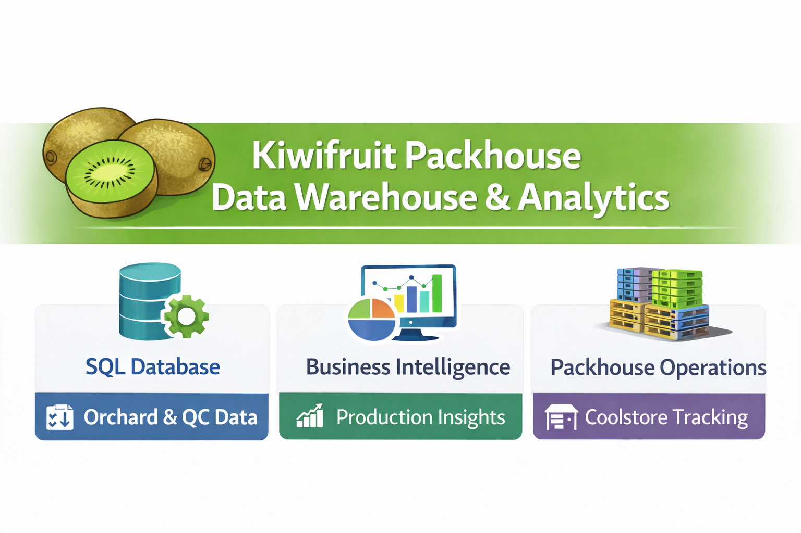

# Kiwifruit Packhouse Data Warehouse & Analytics

A complete end‑to‑end **data warehouse and analytics platform** for kiwifruit packhouse operations.
Built using **SQL Server**, **T‑SQL**, and **Power BI**, this project models the full post‑harvest workflow, from orchard intake through packing, QC, palletisation, coolstore storage, and downtime analysis.

---

# Table of Contents
- [Purpose of This Project](#purpose-of-this-project)
- [Project Overview](#project-overview)
- [Key Features](#key-features)
- [Power BI Dashboard Gallery](#power-bi-dashboard-gallery)
- [High‑Level Architecture Overview](#high-level-architecture-overview)
- [Data Pipeline Overview](#data-pipeline-overview)
  - [Data Sources](#data-sources)
  - [Data Transformation Flow](#data-transformation-flow)
- [Data Warehouse Schema](#data-warehouse-schema)
  - [Dimensions](#dimensions)
  - [Fact Tables](#fact-tables)
  - [Reference Tables](#reference-tables)
- [Entity Relationship Diagram (ERD)](#entity-relationship-diagram-erd)
- [Glossary](#glossary)
- [Technologies Used](#technologies-used)
- [Repository Structure](#repository-structure)

---

# Purpose of This Project

This project demonstrates how operational data from a kiwifruit packhouse can be transformed into a unified, analytics‑ready data warehouse.
It showcases practical skills in:

- **Data engineering** - staging, validation, transformation, and SCD2 dimension handling  
- **Data warehouse modelling** - facts, dimensions, and reference tables aligned to real packhouse processes  
- **Analytical SQL development** - governed semantic views for consistent business logic  
- **Business intelligence** - Power BI dashboards for production, quality, throughput, and coolstore insights  

It serves as a complete learning and demonstration resource for anyone wanting to understand how operational data from orchard, packing, QC, coolstore, and downtime systems can be integrated into a single analytics‑ready warehouse. Together with the end‑to‑end implementation, this repository stands as a portfolio‑ready example of modern data architecture and analytics in a horticultural processing environment.

---

# Project Overview

This project models the operational workflow of a New Zealand kiwifruit packhouse.
It captures data from orchard blocks, packing lines, QC inspections, pallet movements, coolstore storage, and downtime events, enabling end‑to‑end visibility across production and quality.

The project reflects real‑world **data engineering**, **data warehousing**, and **BI development** using industry‑aligned terminology and structures.

---

# Key Features

### SQL Server Data Warehouse
- Star‑schema dimensional model  
- SCD2 dimensions (Grower, Block)  
- Fact tables for Packing, QC, Pallets, Coolstore, and Downtime  

### Analytical SQL Views
- Season‑level production metrics  
- Variety, grower, and block performance  
- Packline throughput, efficiency, and downtime  
- Packing grade and class insights  
- QC sampling, defect trends, and maturity metrics  
- Pallet movements and coolstore inventory  

### Power BI Dashboards
- **Season Overview**  
- **Variety Performance**  
- **Grower Performance**  
- **Block Performance**  
- **Packline Performance & Throughput**  
- **Packing Insights**  
- **QC Dashboard**  
- **Pallet & Coolstore**  
- **Downtime Analysis**  

---

# Power BI Dashboard Gallery

Below are selected screenshots from the Power BI analytics suite included in this project.

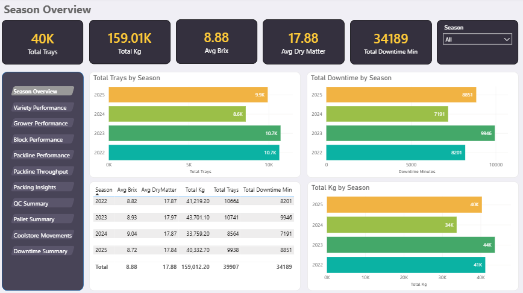

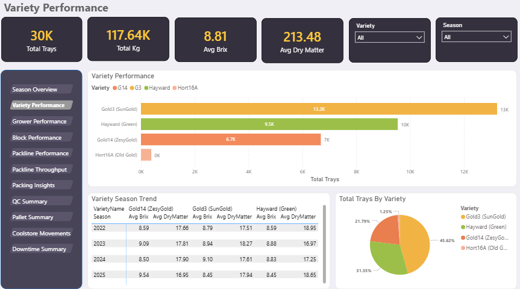

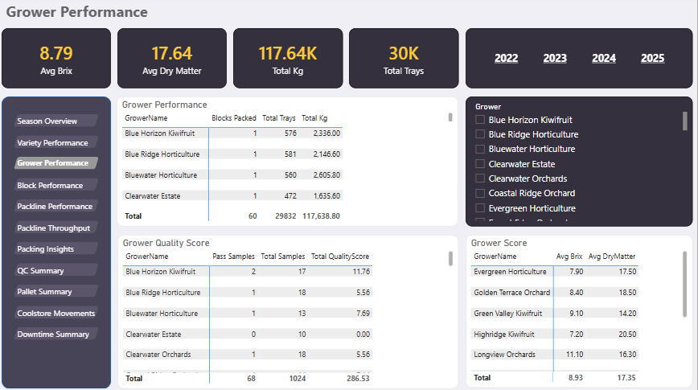

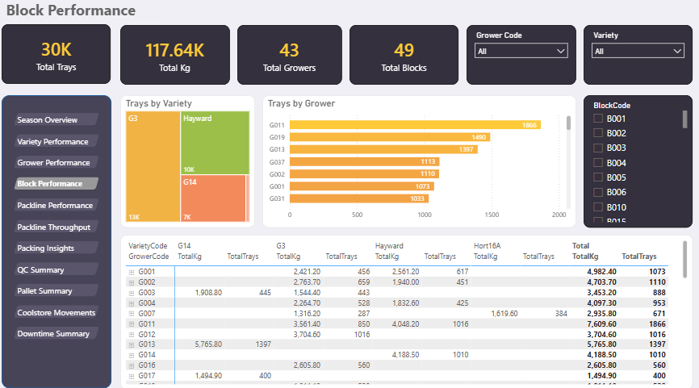

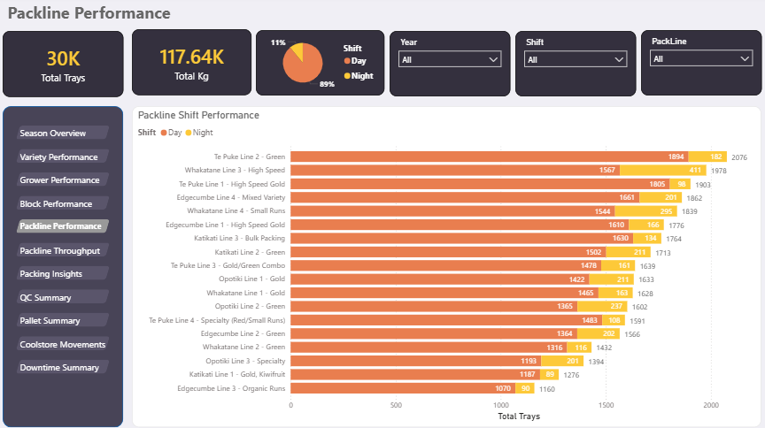

<details>
  <summary><strong>More Dashboard Screenshots</strong></summary>

  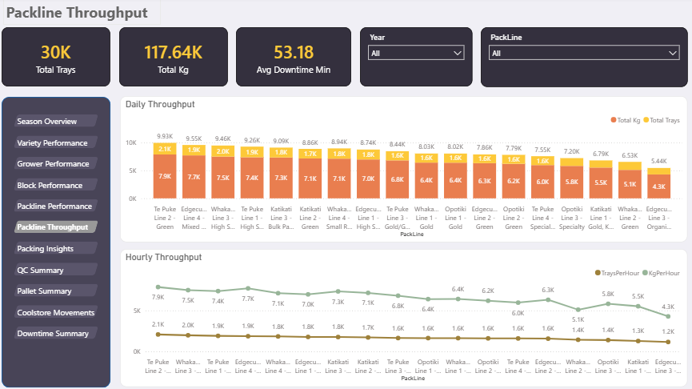

  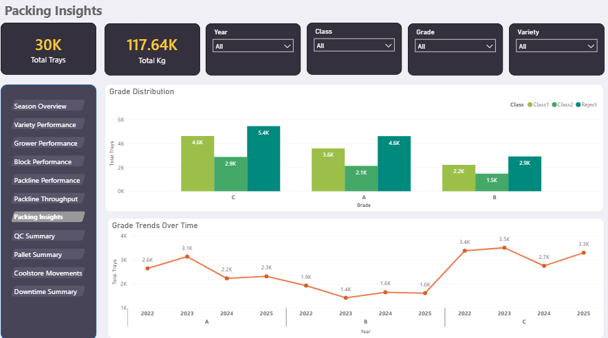

  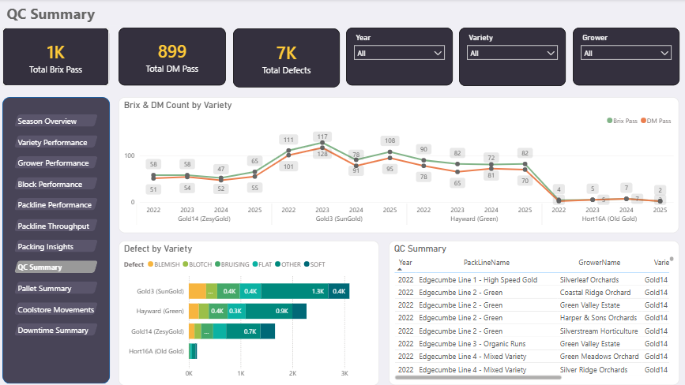

  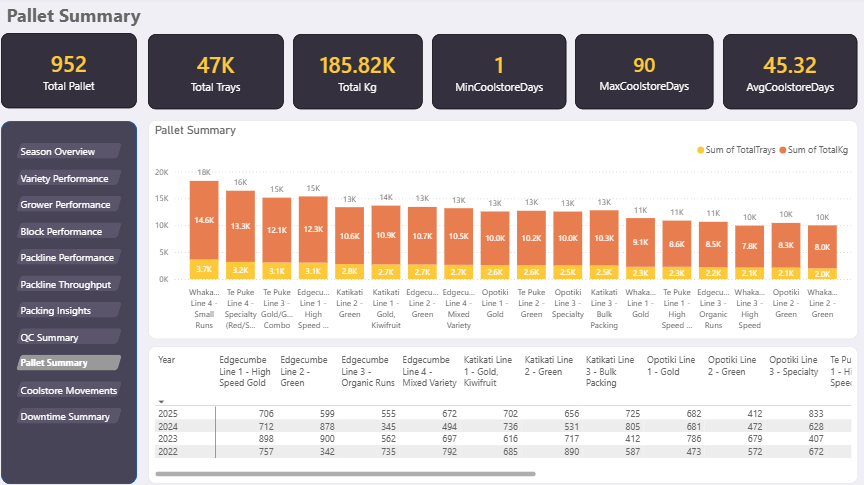

  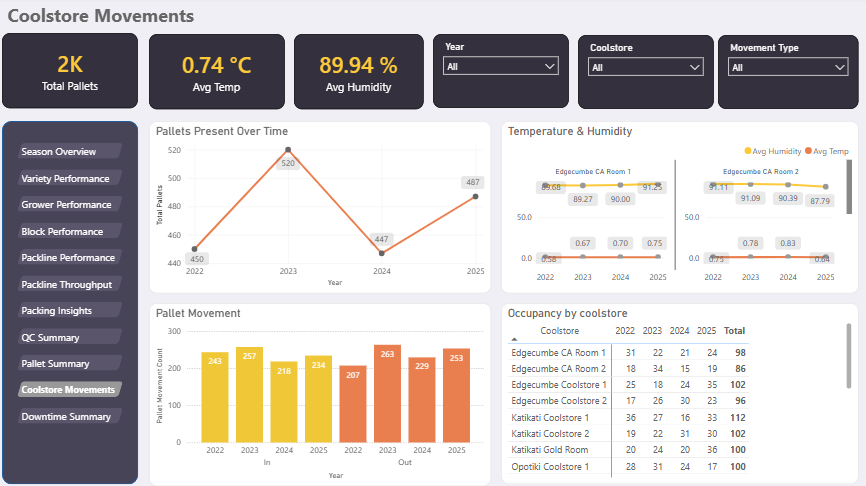

  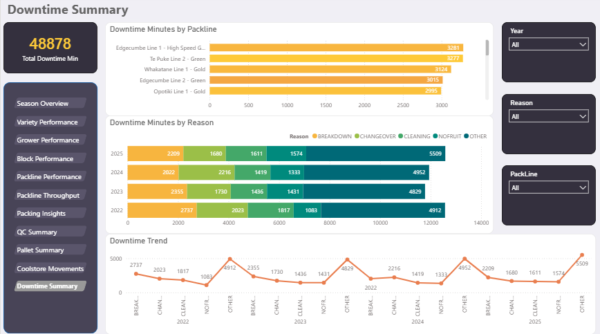

</details>

---

# High-Level Architecture Overview

The platform consolidates operational data from orchard, packing, QC, coolstore, downtime, and dispatch systems into a unified SQL Server warehouse.
Data is ingested via structured staging, validated, transformed, and modelled into a dimensional schema. Curated SQL Semantic Views provide a governed analytical layer consumed by Power BI dashboards.

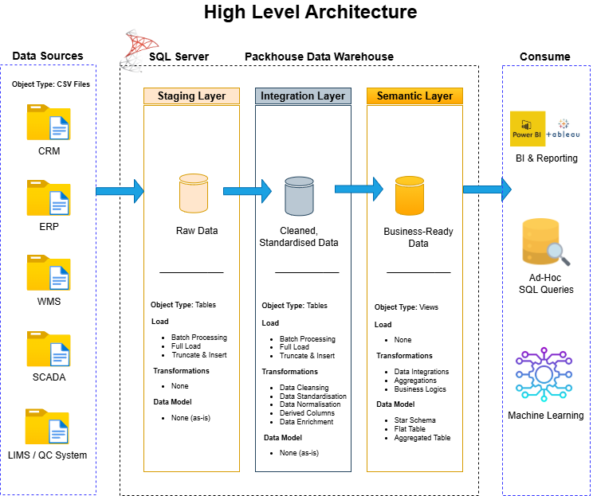

---

# Data Pipeline Overview

## Data Sources
Synthetic datasets emulate real packhouse systems, including:

| Data Domain | Source System | System Type | Example Platform |
|------------|----------------|-------------|------------------|
| Orchard Metadata | Grower/block registration | ERP / Farm Mgmt | FreshInsights, Croptracker |
| Packing Throughput | Line performance | MES (Manufacturing Execution System) | Packhouse line control |
| Quality Inspections | Defects, grades | LIMS (Laboratory Information Management System) / QC | FreshInsights QC |
| Coolstore Movements | Pallet storage | WMS (Warehouse Management System) | Radfords Coolstore |
| Downtime Logs | Machine stoppages | SCADA / Maintenance System | PLC / downtime tracker |
| Customer & Dispatch | Orders, shipments | ERP / CRM | Dynamics, SAP |

## Data Transformation Flow
- CSV extracts ingested into **staging**  
- Validation and standardisation  
- Transformation into **Dimensions**, **Facts**, and **Reference tables**  
- Exposure through **SQL Semantic Views**  
- Consumption by **Power BI dashboards**

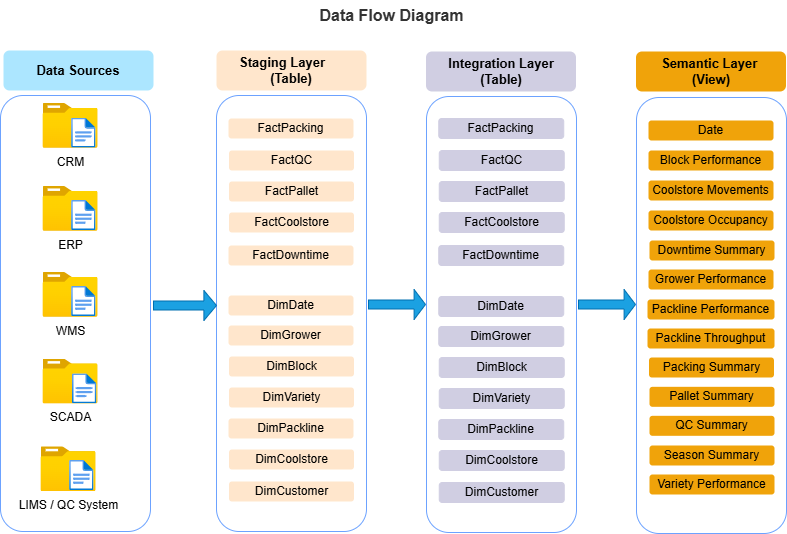

---

# Data Warehouse Schema

## Dimensions
Dimensions store descriptive business attributes used for slicing, filtering, and grouping analytics i.e. who, what, where, and when of the business to support meaningful analysis. 

- `DimDate`  
- `DimGrower`(SCD2 - Slowly Changing Dimension Type 2)   
- `DimBlock`  (SCD2 - Slowly Changing Dimension Type 2)   
- `DimVariety`  
- `DimPackLine`  
- `DimCoolstore`  
- `DimCustomer`  

## Fact Tables
Fact tables store measurable events and numeric values used for aggregation.  

- `FactPacking`  
- `FactQC`  
- `FactPallet`  
- `FactCoolstore`  
- `FactDowntime`  

## Reference Tables
Reference tables hold standard lookup codes for consistent data interpretation.  

- `RefDefect`  
- `RefDowntimeReason`  

---

# Entity Relationship Diagram (ERD)

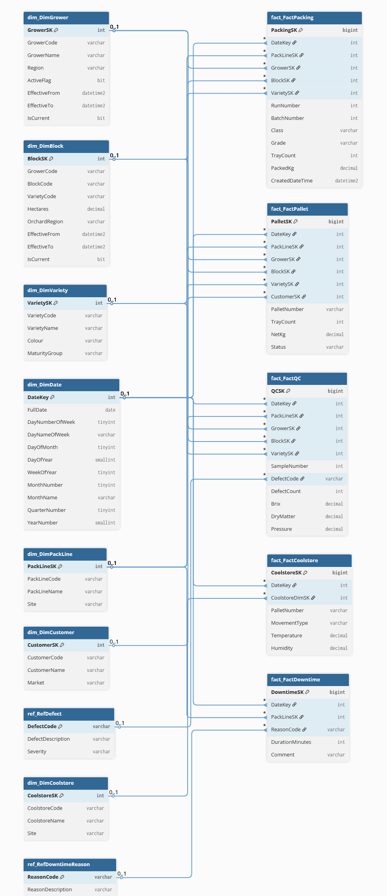

---

# Glossary

A comprehensive glossary explaining key horticultural and post‑harvest terms, including Brix, Dry Matter, Pressure, tray counts, movement types, defect codes, and more.

| **Term** | Meaning | Ideal / Typical Values | Industry Explanation |
|----------|---------|------------------------|----------------------|
| **Grower Code** | Unique identifier for a grower supplying fruit. | N/A | Identifies the orchard owner for traceability and performance reporting. |
| **Block Code** | Identifier for an orchard block. | N/A | Used to track fruit quality and yield at a block level. |
| **Variety Code / VarietyName** | Identifies kiwifruit variety (e.g., Hayward, SunGold). | N/A | Different varieties have different maturity rules and storage behaviour. |
| **Tray Count** | Number of trays packed or on a pallet. | 100-120 trays per pallet | Standard pallet configuration in NZ packhouses. |
| **Packed Kg / TotalKg** | Total kilograms packed or produced. | 600-900 kg per pallet | Typical net weight range depending on tray type and fruit size. |
| **Movement Type** | Coolstore movement: In, Out, Relocate. | N/A | Tracks pallet flow for inventory accuracy and cold chain compliance. |
| **Temperature** | Coolstore temperature (°C). | 0-1°C | Optimal storage temperature to slow ripening and maintain firmness. |
| **Humidity** | Coolstore humidity (%RH). | 90-95% RH | High humidity prevents fruit dehydration and weight loss. |
| **Pallet Number** | Unique pallet identifier. | N/A | Critical for traceability from orchard to export. |
| **DaysInCoolstore** | How long a pallet has been stored. | As low as possible | Longer storage increases softening risk and reduces market life. |
| **Defect Code** | QC defect type (e.g., blemish, rot). | N/A | Used to classify and monitor fruit quality issues. |
| **Defect Count / Total Defects** | Number of defects found in QC sample. | As low as possible | High defect rates indicate orchard issues or packing line problems. |
| **Brix** | Sugar level of fruit (°Bx). | SunGold (G3): 6.5-7.5+<br>Hayward (Green): 6.2-6.8+ | Minimum Brix ensures fruit sweetness and export maturity compliance. |
| **Dry Matter** | Percentage of solids; key flavour predictor. | SunGold: 16-18%+<br>Hayward: 15-17%+ | Higher DM strongly correlates with better flavour and consumer satisfaction. |
| **Pressure** | Fruit firmness (kgf). | SunGold: 6-8 kgf<br>Hayward: 7-9 kgf | Ensures fruit is firm enough for export and long storage. |
| **PassFail Status** | Whether QC sample passed maturity rules. | Pass | Ensures fruit meets Zespri maturity standards before packing. |
| **Quality Score** | Numeric score summarising quality. | Higher = better | Aggregates QC performance across samples or growers. |
| **Reason Code** | Downtime reason (mechanical, labour, cleaning). | N/A | Helps identify bottlenecks and operational inefficiencies. |
| **Duration Minutes** | Length of downtime event. | As low as possible | Directly impacts throughput and OEE performance. |
| **Quality Rate** | QC pass rate for OEE. | >90% preferred | High quality rate indicates consistent fruit maturity and packing accuracy. |
| **Pallet Count** | Number of pallets produced or stored. | N/A | Key metric for daily throughput and coolstore utilisation. |
| **Avg Brix / Avg Dry Matter** | Average maturity metrics. | SunGold: Brix 6.5-7.5+, DM 16-18%+<br>Hayward: Brix 6.2-6.8+, DM 15-17%+ | Used to monitor overall fruit quality trends across growers and seasons. |
---

# Technologies Used

- **SQL Server** - Data warehouse & storage  
- **T‑SQL** - ETL, SCD2 logic, analytical views  
- **Power BI** - Dashboards & reporting  
- **Markdown** - Documentation  
- **GitHub** - Version control & portfolio  

---

# Repository Structure

```plaintext
kiwifruit-packhouse-data-warehouse-analytics/

├── README.md
├── datasets/
│   └── raw/                # Original CSV extracts (orchard, packing, QC, coolstore, downtime)
|
├── sql/
│   ├── schema/             # CREATE DATABASE/TABLE scripts (Dimensions, Facts, Reference)
│   └── semantic-views/     # Analytical SQL views used by Power BI
|
├── power-bi/                    
│   ├── pbix/               # Power BI Desktop files
│   └── images/             # Dashboard screenshots (Season, Variety, Grower, etc.)
|
└── docs/                   # Project documentation assets such as architecture diagrams, data‑flow visuals, ERD etc.
    ├── packhouse-dw-banner.png
    ├── packhouse-dw-high-level-architecture.png
    ├── packhouse-dw-data-flow-diagram.png
    └── erd.png
